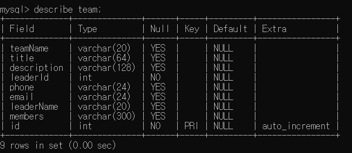

# Introduction

- 스마트시스템소프트웨어 학과의 경진대회 관련 올인원 웹서비스

- 경진대회 관련안내, 신청서 제출, 신청현황 확인 등 

# Installation

```
git clone https://github.com/WebSmartSW/backend.git

```

# Making DB & Table

- MYSQL DB 생성 후 .env에 개인 정보 입력
- 신청서 제출 위해 아래와 같은 테이블 생성 
<p align="center">
  
</p>


# START

```
cd backend
npm start
```


# API
 
         
■ team 관련 API

1. /admin/team/list

- GET : 작성한 모든 신청서를 확인할 수 있다.

- 개별 신청서의 경우 front-end에서 처리

- 전체 신청서 로드 

■ apply 관련 API

1. /admin/apply/ 

- POST : 신청서 작성 후 제출 시 post

- 사용자가 작성한 모든 정보가 post

- auto_increment id를 이용해 개별 신청서를 로드 할 수 있게 하였다. 


